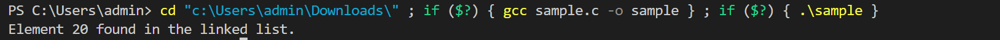
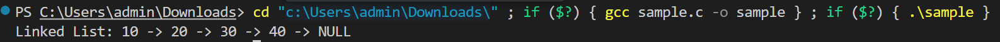
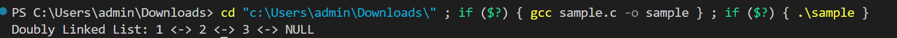
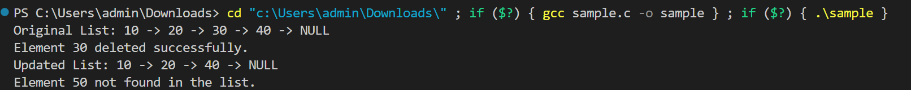

## EXP NO:16 C PROGRAM TO SEARCH A GIVEN ELEMENT IN THE GIVEN LINKED LIST.
## Aim:
To write a C program to search a given element in the given linked list.

## Algorithm:
1.	Define the structure for a node in a linked list.
2.	Define the search function to find a specific character in the linked list.
3.	Initialize the head of the linked list as needed.
4.	Call the search function and perform other linked list operations as needed.
 
## Program:
```c
#include <stdio.h>
#include <stdlib.h>
struct Node {
    int data;
    struct Node *next;
};
int search(struct Node *head, int element) {
    struct Node *current = head;
    while (current != NULL) {
        if (current->data == element) {
            return 1;  
        }
        current = current->next;
    }
    return 0;  
}
void insert(struct Node **head, int data) {
    struct Node *newNode = (struct Node*)malloc(sizeof(struct Node));
    newNode->data = data;
    newNode->next = *head;
    *head = newNode;
}
int main() {
    struct Node *head = NULL;
    insert(&head, 10);
    insert(&head, 20);
    insert(&head, 30);
    insert(&head, 40);
    int element = 20;
    if (search(head, element)) {
        printf("Element %d found in the linked list.\n", element);
    } else {
        printf("Element %d not found in the linked list.\n", element);
    }
    return 0;
}
```
## Output:

## Result:
Thus, the program to search a given element in the given linked list is verified successfully.


 
## EXP NO:17  PROGRAM TO INSERT A NODE IN A LINKED LIST.
## Aim:
To write a C program to insert a node in a linked list.
## Algorithm:
1.	Define the structure for a node in a linked list
2.	Define the insert function to insert a new node with character data at the end of the linked list.
3.	Initialize the head of the linked list as needed.
4.	Call the insert function and perform other linked list operations as needed.
 
## Program:
```c
#include <stdio.h>
#include <stdlib.h>
struct Node {
    int data;
    struct Node *next;
};
void insert(struct Node **head, int data) {
    struct Node *newNode = (struct Node*)malloc(sizeof(struct Node));
    struct Node *last = *head;
    newNode->data = data;
    newNode->next = NULL;
    if (*head == NULL) {
        *head = newNode;
        return;
    }
    while (last->next != NULL) {
        last = last->next;
    }
    last->next = newNode;
}
void display(struct Node *head) {
    struct Node *current = head;
    while (current != NULL) {
        printf("%d -> ", current->data);
        current = current->next;
    }
    printf("NULL\n");
}
int main() {
    struct Node *head = NULL;
    insert(&head, 10);
    insert(&head, 20);
    insert(&head, 30);
    insert(&head, 40);
    printf("Linked List: ");
    display(head);
    return 0;
}
```
## Output:

## Result:
Thus, the program to insert a node in a linked list is verified successfully.


 
## EXP NO:18 C PROGRAM TO TRAVERSE A DOUBLY LINKED LIST
## Aim:
To write a C program to traverse a doubly linked list.

## Algorithm:
1.	Initialize a temporary pointer (temp) to the head of the list.
2.	Use a while loop to traverse the list until the end (temp == NULL) is reached.
3.	Inside the loop, print the data of the current node.
4.	Move to the next node by updating the temp pointer to point to the next node (temp = temp->next).
 
## Program:
```c
#include <stdio.h>
#include <stdlib.h>
struct Node {
    int data;
    struct Node *next;
    struct Node *prev;
};
void traverse(struct Node *head) {
    struct Node *temp = head;
    while (temp != NULL) {
        printf("%d <-> ", temp->data);
        temp = temp->next;
    }
    printf("NULL\n");
}
int main() {
    struct Node *head = NULL;
    struct Node *second = NULL;
    struct Node *third = NULL;
    head = (struct Node*)malloc(sizeof(struct Node));
    second = (struct Node*)malloc(sizeof(struct Node));
    third = (struct Node*)malloc(sizeof(struct Node));
    head->data = 1;
    head->next = second;
    head->prev = NULL;
    second->data = 2;
    second->next = third;
    second->prev = head;
    third->data = 3;
    third->next = NULL;
    third->prev = second;
    printf("Doubly Linked List: ");
    traverse(head);

    return 0;
}
```
## Output:

## Result:
Thus, the program to traverse a doubly linked list is verified successfully. 


## EXP NO:19 C PROGRAM TO INSERT AN ELEMENT IN DOUBLY LINKED LIST
## Aim:
To write a C program to insert an element in doubly linked list

## Algorithm:
1.	Create a new node (newNode) and allocate memory for it.
2.	Set the data of the new node to the provided value.
3.	If the list is empty, set the new node as the head.
4.	If the list is not empty, traverse the list to find the last node.
5.	Set the new node's prev pointer to the last node and update the last node's next pointer to the new node.
 
## Program:
```c
#include <stdio.h>
#include <stdlib.h>
struct Node {
    int data;
    struct Node *next;
    struct Node *prev;
};
void insert(struct Node **head, int value) {
    struct Node *newNode = (struct Node*)malloc(sizeof(struct Node));
    newNode->data = value;
    newNode->next = NULL;  
    if (*head == NULL) {
        newNode->prev = NULL;  
        *head = newNode;      
        return;
    }
    struct Node *last = *head;
    while (last->next != NULL) {
        last = last->next;
    }
    newNode->prev = last;
    last->next = newNode;
}
void traverse(struct Node *head) {
    struct Node *temp = head;
    while (temp != NULL) {
        printf("%d <-> ", temp->data);
        temp = temp->next;
    }
    printf("NULL\n");
}
int main() {
    struct Node *head = NULL;  
    insert(&head, 10);
    insert(&head, 20);
    insert(&head, 30);
    printf("Doubly Linked List: ");
    traverse(head);
    return 0;
}
```
## Output:

## Result:
Thus, the program to insert an element in doubly linked list is verified successfully.


## EXP NO:20 C FUNCTION TO DELETE A GIVEN ELEMENT IN THE GIVEN LINKED LIST

## Aim:
To write a C function that deletes a given element from a linked list.

## Algorithm:
1.	Check if the Linked List is Empty:
o	If the head of the linked list is NULL, print a message indicating the list is empty and exit the function.
2.	Traverse the Linked List:
o	Start from the head node and iterate through the list to find the node that contains the given element (data).
3.	Handle Deletion of the First Node:
o	If the element to be deleted is found in the head node:
	Update the head of the linked list to point to the next node (i.e., head = head->next).
	Free the memory allocated to the node to be deleted.
	Exit the function.
4.	Traverse and Delete from the Middle or End:
o	If the element is not in the head node, continue traversing the list by checking each node’s next pointer.
o	When the node with the element is found, update the previous node’s next pointer to point to the next node of the node to be deleted (prev->next = current->next).
o	Free the memory allocated to the node to be deleted.
5.	Handle the Case when the Element is Not Found:
o	If the element is not found in any node, print a message indicating the element is not present in the list.
6.	End the Function.


## Program:
```c
#include <stdio.h>
#include <stdlib.h>

// Define the structure for a node in a linked list
struct Node {
    int data;
    struct Node* next;
};

// Function to delete a given element from the linked list
void deleteElement(struct Node** head, int value) {
    // Check if the list is empty
    if (*head == NULL) {
        printf("The list is empty.\n");
        return;
    }

    struct Node* temp = *head;
    struct Node* prev = NULL;

    // If the element to be deleted is at the head
    if (temp != NULL && temp->data == value) {
        *head = temp->next; // Move head to the next node
        free(temp);         // Free memory of the deleted node
        printf("Element %d deleted successfully.\n", value);
        return;
    }

    // Traverse the list to find the element
    while (temp != NULL && temp->data != value) {
        prev = temp;
        temp = temp->next;
    }

    // If the element was not found
    if (temp == NULL) {
        printf("Element %d not found in the list.\n", value);
        return;
    }

    // Unlink the node from the linked list
    prev->next = temp->next;
    free(temp); // Free memory of the deleted node
    printf("Element %d deleted successfully.\n", value);
}

// Function to print the linked list
void printList(struct Node* head) {
    struct Node* temp = head;
    while (temp != NULL) {
        printf("%d -> ", temp->data);
        temp = temp->next;
    }
    printf("NULL\n");
}

// Main function to test the deleteElement function
int main() {
    struct Node* head = NULL;

    // Create the linked list: 10 -> 20 -> 30 -> 40 -> NULL
    struct Node* first = (struct Node*)malloc(sizeof(struct Node));
    struct Node* second = (struct Node*)malloc(sizeof(struct Node));
    struct Node* third = (struct Node*)malloc(sizeof(struct Node));
    struct Node* fourth = (struct Node*)malloc(sizeof(struct Node));

    head = first;
    first->data = 10;
    first->next = second;

    second->data = 20;
    second->next = third;

    third->data = 30;
    third->next = fourth;

    fourth->data = 40;
    fourth->next = NULL;

    printf("Original List: ");
    printList(head);
    // Deleting an element
    deleteElement(&head, 30);
    printf("Updated List: ");
    printList(head);
    // Try deleting an element not in the list
    deleteElement(&head, 50);
    return 0;
}
```
## Output:

## Result:
Thus, the function that deletes a given element from a linked list is verified successfully.


